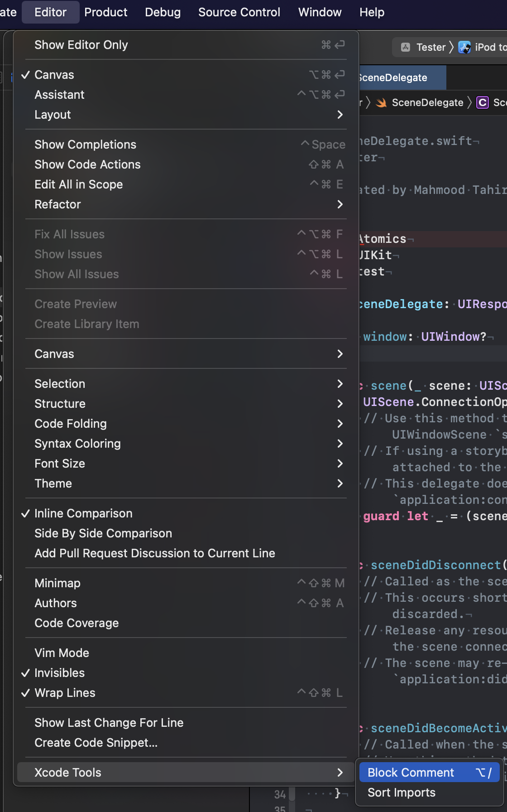
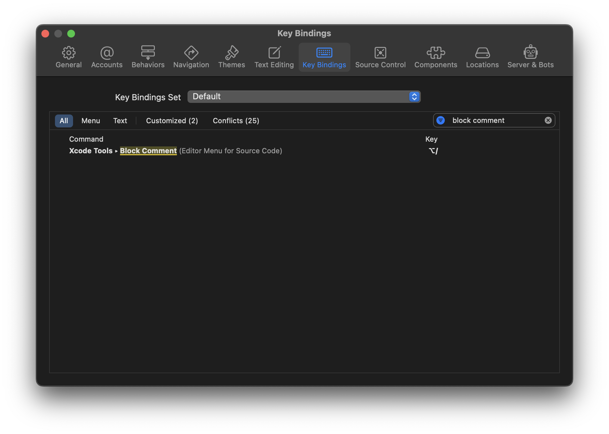
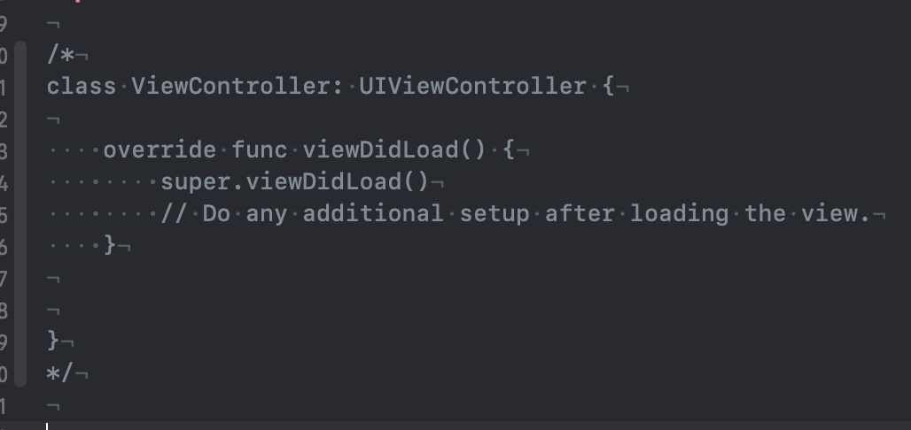

# XcodeTools

A few Xcode helper editor extensions

### Installation

#### Easy

1. Open `XcodeTools.xcodeproj`
2. Set your development team as your apple ID
3. Open Terminal and run `make`
4. `open /Applications/XcodeTools.app`
5. Relaunch Xcode

#### Manual

1. Clone the repo / download zip
2. Archive the app target
3. Export without notorization
4. Put in `Applications` directory
5. Run once and quit.
6. Relaunch Xcode

#### Troubleshooting

1. Open `System Preferences`
2. Go to `Extensions`
3. Ensure you have `Xcode Tools` selected under `Xcode Source Editor` extensions

## Tools

### Sort Imports

Sorts the imports alphabetically.

### Block comment

Create a block style comment `/**/` with a tap or a shortcut

